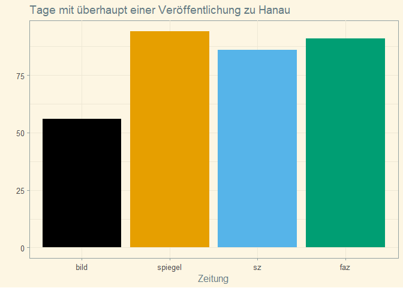

Tweets on hanau-media
================

Erhält die Aufarbeitung des Hanau-Attentats genug gesellschaftliche
Aufmerksamkeit? Das ist schwer zu quantifizieren. Es scheint aber, als
ob große Zeitungen es (aus vielerlei Gründen) wenig thematisieren.

Ein Daten-🧵 und ein Aufruf Hanau und den Betroffenen mehr Raum zu geben.
<!-- -->

Anschläge prägen Diskurse über lange Zeit und werden so aufgearbeitet.
Das ist wichtig, besonders wenn erkennbare Ursachen (z.B Rassismus) zu
Grunde liegen. Als Maß für mediale Aufmerksamkeit, zähle ich
Suchergebnisse zu passenden Schlagwörtern in @Bild, @SZ, @FAZ,
@derspiegel

<!-- -->

Insgesamt listen diese Zeitungen über 710 Veröffentlichungen zu
Suchwörtern zum rassistischen Anschlag in Hanau  Bild: 122 
SZ: 205  Spiegel: 212  FAZ: 179.  

Traurigerweise listet Bild aber an über 300 Tagen des letzten Jahres
garnichts zu dem Thema (SZ: 279, Spiegel: 271, FAZ: 274)

<!-- -->

Ist das wenig? Wenn ja, ist das so weil sich die Tat nicht gegen die
weiße Mehrheit richtete? Leid ist unvergleichbar. Mediale Fokussierung
nicht.

Zu Hanau finden sich etwa so viele Einträge wie zum Ansbach-Anschlag,
der medial weniger diskutiert wurde als z.B. \#Breitscheidplatz

Zum Weihnachtsmarkt-Attentat gibt es für das erste Jahr über 2300
Veröffentlichungen. Jede Zeitung hat fast für jeden 2. Tag etwas. Bei
der Bild noch öfter.  Bild: 1245 Such-Hits an 238 Tagen  SZ: 423
Hits 167 an Tagen  FAZ: 250 Hits an 107 Tagen  Spiegel: 437 Hits
an 155 Tagen

<!-- -->
<!-- -->

Caveats: So eine Analyse ist natürlich massiv Lückenhaft:

<ol>

<li>

Veröffentlichungen unterscheiden sich in Länge, Qualität und
Ausrichtung. Hier werden alle gleich gezählt.

</li>

<li>

Text-Suche ist nie perfekt. Manche Veröffentlichungen fehlen andere
falsch zugeordnet.

</li>

<li>

Aufarbeitung passiert auch auf anderen Wegen als in Zeitungen.

</li>

<li>

Aufmerksamkeit ist ein knappes Gut. Andere Themen können Anschläge aus
den Medien verdrängen (z.B. Trumps 2017, Corona 2020). Die
verhältnismäßig geringe Artikeldichte hangt sicher *auch* mit Corona
zusammen.

</li>

</ol>

Der Code für die Analyse und weitere erklärende Details sind zugänglich,
prüfbar und replizierbar unter: github.com/simonheb/hanau-media. Die
Daten sind via: simonheb.shinyapps.io/hanau-media/ einsehbar. Es gibt
natürlich keine Garantie für die Richtigkeit der Zahlen und Ergänzungen
und Korrekturen sind willkommen.
