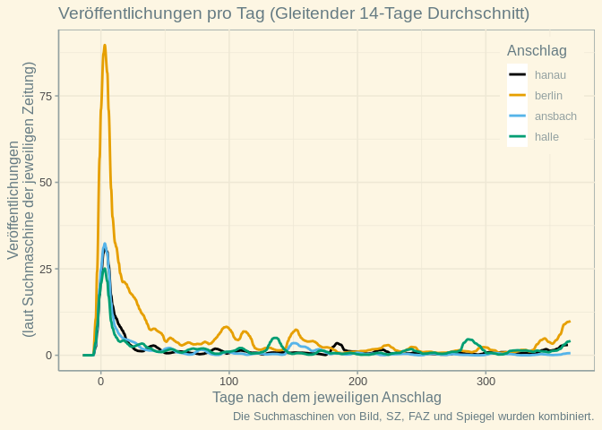
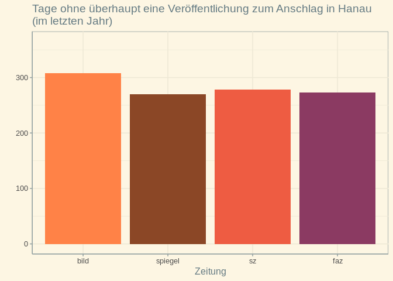
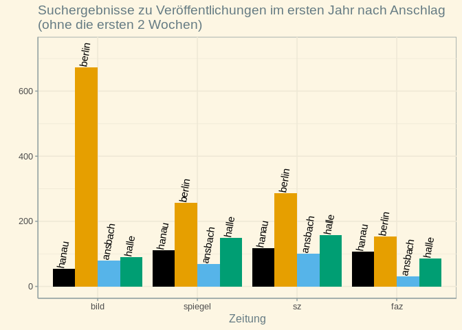
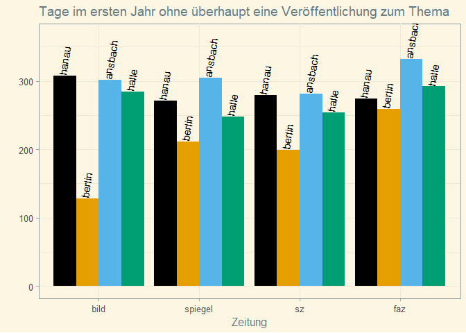

Tweets on hanau-media
================

Das rassistische Hanau-Attentat jährt sich. Erhält die Aufarbeitung
angemessene gesellschaftliche Aufmerksamkeit? Das ist schwer zu
quantifizieren. Es scheint aber als ob große Zeitungen es weniger
thematisieren

Daten-Thread und Aufruf Hanau und Betroffenen mehr Raum zu geben 🧵
<!-- -->

Anschläge prägen Diskurse in Medien und werden so gesellschaftlich
aufgearbeitet. Das ist wichtig, wenn systemische Ursachen (Rassismus)
erkennbar sind. Als Maß für mediale Aufmerksamkeit zähle ich
automatisiert Suchergebnisse zu passenden Schlagworten in @Bild @SZ @FAZ
@spiegel

<!-- -->

Insgesamt listen diese Zeitungen über 710 Veröffentlichungen zu
Suchwörtern zum rassistischen Anschlag in Hanau  Bild: 122 
SZ: 205  Spiegel: 212  FAZ: 179  

Dabei listet Bild aber an über 300 Tagen des letzten Jahres garnichts zu
dem Thema (SZ: 279, Spiegel: 271, FAZ: 274)

<!-- -->

Ist das wenig? Wenn ja, ist das so weil sich die Tat nicht gegen die
weiße Mehrheit richtete? Leid ist unvergleichbar. Mediale Fokussierung
nicht.

Zu Hanau finden sich ähnlich viele Einträge wie zum Ansbach-Anschlag,
bei dem niemand starb aber 15 Menschen zum Teil schwer verletzt wurden.
Dieser Anschlag erhielt medial weit weniger Aufmerksamkeit als der vom
Berliner Weihnachtsmarkt/Breitscheidplatz.

Zum Berliner Attentat gibt es im ersten Jahr über 2300
Suchergebnisse—fast jeden zweiten Tag findet sich in jeder Zeitung
eine Erwähnung. Bei Bild an zwei von drei Tagen:  Bild: 1245
Such-Hits (238 Tage)  SZ: 423 Hits (167 Tage)  FAZ: 250 Hits
(107 Tage)  Spiegel: 437 Hits (155 Tage)

<!-- -->
<!-- --> Zwischenfazit: Es
scheint als wird zu anderen Attentaten viel, häufig und lange
geschrieben. Das ist meist gut und das sollten wir für \#Hanau auch tun.

Lest und diskutiert mit Freunden und redet mit Betroffenen von
Rassismus.

Solche Analysen sind immer lückenhaft

<ol>

<li>

Texte unterscheiden sich in Länge, Qualität und Richtung. Hier werden
alle gleich gezählt.

</li>

<li>

Textsuche ist imperfekt. Manche Veröffentlichungen fehlen andere sind
falsch zugeordnet. Unpassende Suchworte könnten alles kaputt machen.

</li>

<li>

Aufarbeitung passiert auch auf anderen Wegen als in Zeitungen.

</li>

<li>

Aufmerksamkeit ist ein knappes Gut. Andere Themen können Anschläge aus
den Medien verdrängen (z.B. Trumps 2017, Corona 2020). Die
verhältnismäßig geringe Artikeldichte hängt sicher *auch* mit Corona
zusammen.

</li>

</ol>

Code und wichtige Details sind zugänglich und prüfbar:
github.com/simonheb/hanau-media Daten sind einsehbar via:
simonheb.shinyapps.io/hanau-media/ Updates zum Thread:
github.com/simonheb/hanau-media/blob/main/tweets.md

Es gibt natürlich keine Garantie für die Richtigkeit der Zahlen.
Ergänzungen/Korrekturen sind willkommen

Follow Empfehlungen: @19FebruarHanau @Oezlem\_Gezer @BI\_FerhatUnvar
@AmadeuAntonio @KeinSchlussstr\_ @TemizUnvar @Dilanee Bitte ergänzen.

\#SayTheirNames:
<https://www.youtube.com/watch?v=Qu0NM_TYOPM&feature=emb_title>
