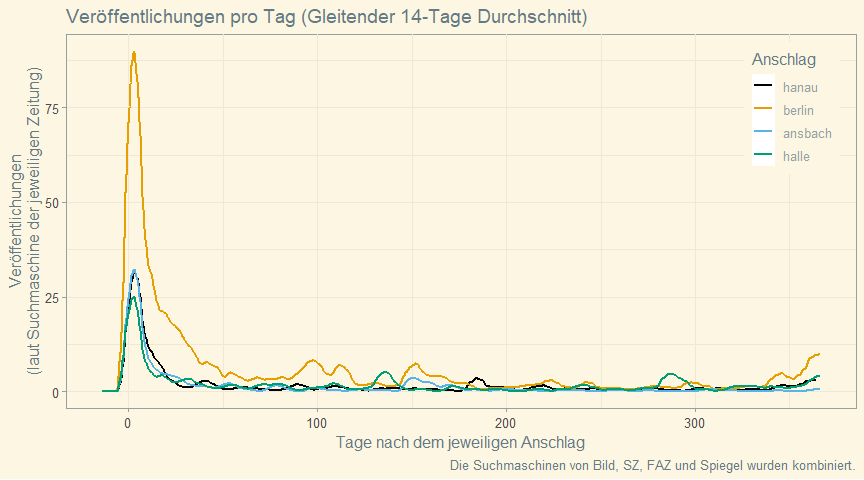
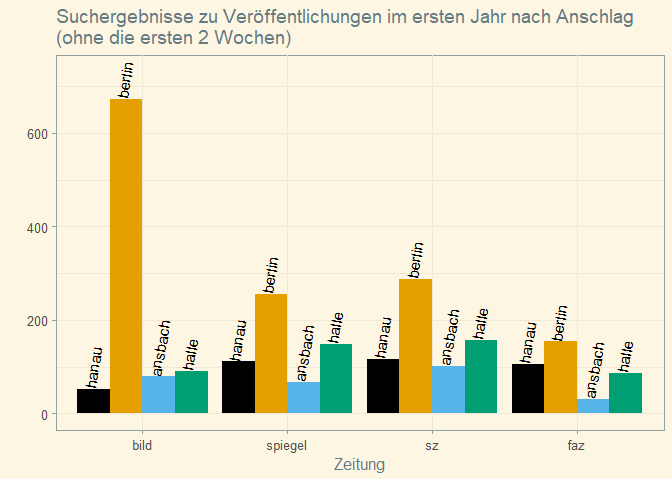

Tweets on hanau-media
================

Das rassistische Attentat von \#Hanau jährt sich. Erhält die
Aufarbeitung angemessene gesellschaftliche Aufmerksamkeit? Das ist
schwer zu messen. Es scheint aber als ob große Zeitungen es weniger
thematisieren

Daten-Thread & Aufruf dazu Hanau und Betroffenen mehr Raum zu geben 🧵

<!-- -->

Anschläge prägen Diskurse in Medien und werden so von uns aufgearbeitet.
Das ist wichtig, wenn gesellschaftliche Ursachen (Rassismus) erkennbar
sind. Als Maß für mediale Aufmerksamkeit zähle ich automatisiert
Suchergebnisse zu passenden Schlagworten in @Bild @SZ @FAZ @derspiegel

<!-- -->

Insgesamt listen diese Zeitungen über 710 Veröffentlichungen zu
Suchwörtern zum rassistischen Anschlag in Hanau  Bild: 122 
Spiegel: 212  SZ: 205  FAZ: 179  

Dabei listet Bild aber an über 300 Tagen des letzten Jahres garnichts zu
dem Thema (Spiegel: 271, SZ: 279, FAZ: 274)

<!-- -->

Ist das wenig? Wenn ja, ist das so weil sich die Tat nicht gegen die
weiße Mehrheit richtete? Leid ist unvergleichbar. Mediale Fokussierung
nicht.

Zu Hanau finden sich ähnlich viele Einträge wie zum Ansbach-Anschlag,
bei dem niemand starb aber 15 Menschen zum Teil schwer verletzt wurden.
Dieser Anschlag erhielt medial weit weniger Aufmerksamkeit als der vom
Berliner Weihnachtsmarkt/Breitscheidplatz.

Zum Berlin-Attentat gab es nach 1 Jahr über 2300 Suchergebnisse—fast
jeden 2. Tag eine Erwähnung. In Bild an 2 von 3 Tagen:  Bild: 1245
Such-Hits (127 Tage ohne. Für Hanau waren es \>300)  Spiegel: 437
Hits (210 Tage ohne)  SZ: 423 Hits (198 Tage ohne)  FAZ: 250
Hits (258 Tage ohne)

<!-- -->
<!-- -->

Zwischenfazit: Es scheint als wird zu anderen Attentaten viel, häufig
und lange geschrieben. Das ist meist gut und das sollten wir für \#Hanau
auch tun.

Lest und diskutiert mit Freunden und redet mit Betroffenen von
Rassismus.

Caveats—Solche Analysen sind immer lückenhaft:  1️⃣ Texte
unterscheiden sich in Länge, Qualität und Richtung. Hier werden alle
gleich gezählt  2️⃣ Textsuche ist imperfekt. Manche
Veröffentlichungen fehlen andere sind falsch zugeordnet. Unpassende
Suchworte könnten alles kaputt machen  3️⃣ Aufarbeitung passiert
auch auf anderen Wegen als in Zeitungen  4️⃣ Aufmerksamkeit ist ein
knappes Gut. Andere Themen können Anschläge aus den Medien verdrängen
(z.B. 2017 Trump+2020 Corona). Die verhältnismäßig geringe Artikeldichte
zu Hanau hängt sicher auch mit Corona zusammen

Code und wichtige Details sind zugänglich und prüfbar:
github.com/simonheb/hanau-media Daten sind einsehbar via:
simonheb.shinyapps.io/hanau-media/ Updates zum Thread:
github.com/simonheb/hanau-media/blob/main/tweets.md

Es gibt natürlich keine Garantie für die Richtigkeit der Zahlen.
Ergänzungen/Korrekturen sind willkommen

Follow Empfehlungen: @19FebruarHanau @Oezlem\_Gezer @BI\_FerhatUnvar
@AmadeuAntonio @KeinSchlussstr\_ @TemizUnvar @Dilanee Bitte ergänzen.

\#SayTheirNames:
<https://www.youtube.com/watch?v=Qu0NM_TYOPM&feature=emb_title>
